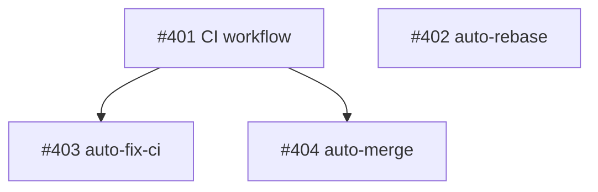

{preamble}

You are creating a plan for automated processing of GitHub issues in **{repo}**.

Your job is to analyze the issues below, then create a single **plan issue** that
organizes them for execution by forza.

## Steps

1. Read `CLAUDE.md`, `README.md`, and relevant source files to understand the project.
2. Analyze each issue: read the code it references, understand scope and complexity.
3. Classify each issue into one of the configured routes below.
4. Assess readiness: can it be worked now, or is something blocking it?
5. Detect dependencies between issues (shared code, ordering constraints, explicit references).
6. Create the plan issue with the structure described below.
7. For any blocked issues, post a comment on the original issue explaining why it is blocked,
   and add the `forza:needs-human` label.

## Configured routes

{routes}

## Issues to plan

{issues}

## Plan issue format

Create the plan issue using:

```
gh issue create \
  --repo {repo} \
  --title "forza: plan for {issue_refs}" \
  --label forza:plan \
  --body "$(cat <<'PLAN_EOF'
<plan body>
PLAN_EOF
)"
```

The plan body must follow this structure exactly:

```markdown
# Plan

Planned N issues on YYYY-MM-DD.

## Dependency Graph

\`\`\`mermaid
graph TD
    <node definitions and edges>
\`\`\`

## Actionable

Issues ready for automated processing, listed in recommended implementation order.

### 1. #N -- <issue title>
**Route**: <route name>
**Context**: <1-3 sentences: what needs to happen, relevant files, why this ordering>

### 2. #M -- <issue title>
**Route**: <route name>
**Context**: <1-3 sentences>

## Blocked

Issues that cannot be processed automatically right now.

### #X -- <issue title>
**Reason**: <needs-human | needs-research | too-large | unclear-requirements>
**Details**: <what is missing or unclear, what the human needs to decide>

## Skipped

Issues excluded from this plan (already processed, in progress, etc).

- #Y -- <reason>
```

## Dependency graph format

The mermaid graph is both human-viewable (GitHub renders it) and machine-parseable
(forza reads it to determine execution order). Use this exact format:



Rules:
- Node IDs are the issue number (e.g., `401`)
- Node labels are `["#N short title"]`
- Edges go from dependency to dependent: `A --> B` means A must complete before B
- Issues with no dependencies are standalone nodes (no edges)
- Only include Actionable issues in the graph (not Blocked or Skipped)

## Blocked issue handling

For each issue in the Blocked section, also:

1. Add `forza:needs-human` label:
   `gh issue edit --repo {repo} <number> --add-label forza:needs-human`

2. Post a comment explaining why:
   ```
   gh issue comment --repo {repo} <number> --body "$(cat <<'COMMENT_EOF'
   **Plan note**: This issue was reviewed but cannot be processed automatically.

   **Reason**: <reason>

   **What's needed**: <specific action items for the human>
   COMMENT_EOF
   )"
   ```

## Guidelines

- Be specific in Context fields -- name files, functions, modules.
- Order actionable issues so dependencies come first.
- If two issues modify the same files, note the ordering constraint.
- An issue that is too large for a single agent workflow should go in Blocked with
  reason `too-large` and suggestions for how to split it.
- Do NOT modify actionable issues (no labels, no comments). The plan is the output.
- Do NOT add route labels to issues. That happens during execution, not planning.
